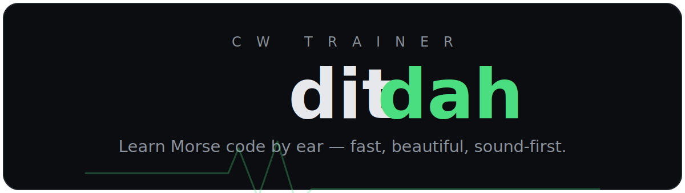

<p align="center">
  <a href="https://dydx404.github.io/ditdah/"></a>
</p>

<p align="center">
  <a href="https://dydx404.github.io/ditdah/"></a>
  <a href="https://github.com/dydx404/ditdah/actions/workflows/ci.yml"></a>
  
  
  <a href="./LICENSE"></a>
</p>

<p align="center">
  <b>The modern way to learn and enjoy Morse code (CW).</b><br>
  A fast, beautiful, <i>sound-first</i> trainer — in the spirit of Monkeytype, Duolingo, and osu!.
</p>

---

Most Morse software still feels like it's from 2004: see a chart of dots and dashes,
then translate in your head. That habit hard-caps you around 10 WPM forever. **ditdah
takes the opposite bet** — you learn the way operators actually copy: **by sound**, one
character at a time, with instant feedback and game feel.

> The character is never shown as dots and dashes while you decode. You hear it, you
> type it. That single rule is the whole product.

### ▶ [Try it live → dydx404.github.io/ditdah](https://dydx404.github.io/ditdah/)
No sign-up, works offline, installable. Turn your sound on and press **Start**.

New to CW? Start with the **[ditdah CW Learner Guidebook](./docs/guidebook/README.md)**:
a sound-first path from your first round to words, callsigns, QSO practice, and Story Mode.

## What's inside

**Seven practice modes**, all built on one sound-first copy loop:

| Mode | What you copy |
|---|---|
| **Learn** | Single letters, introduced one at a time (Koch method) |
| **Copy groups** | Random 5-char groups from your unlocked set |
| **Numbers** | Digit drills |
| **Words** | Real English words |
| **Callsigns** | Realistic ham callsigns (`G4ABC`, `VK2XYZ`, `W1AW`) |
| **Free training** | Your own character set — with a "weak spots" auto-picker |
| **QSO** → **Story** | Realistic on-air exchanges, growing into a narrative campaign |

Plus the things that make it stick:

- **Koch + Farnsworth timing** — full-speed characters, stretched gaps, so beginners get room without slowing the sound.
- **Instant feedback + cues** — click-free Web Audio sidetone, a bell on correct, a low tone on a miss.
- **Progress that lasts** — daily streak, daily goal, rounds with summaries, session history, per-character accuracy.
- **Optional cloud sync** — sign in (magic link) to back up and sync across devices. Anonymous & local-first by default.
- **Yours to tune** — character/overall WPM, sidetone, volume, strict mode, an opt-in dit/dah reference (default off).
- **Everywhere** — keyboard on desktop, on-screen keypad on mobile; **installable PWA**, fully offline.
- **Bilingual UI** — English and 简体中文, switchable in-app.

## Built in the open — by a human + AI

ditdah is developed by a licensed ham + a couple of AI coding agents, coordinating
**entirely through the repo** (issues, PRs, frozen contracts, single-writer status
files). That's why the codebase is unusually modular and easy to join — see
[docs/AGENTS.md](./docs/AGENTS.md).

## Contributing — pick a module and go

New contributors are very welcome. The architecture is **contracts-first**: each module
exposes a frozen `types.ts`, so you can own a piece without stepping on anyone else.

```
core/morse     Character table, Koch order, Farnsworth timing math   (pure)
core/audio     Web Audio sidetone scheduler + UI cues                (pure logic + thin glue)
core/trainer   Session logic: prompts, scoring, unlocks              (pure, deterministic)
core/storage   Local-first persistence                               (async, versioned)
app/*          Browser glue: settings, progress, history, sync, modes, prompt pools
ui/*           React components + the practice loop state machine
content/*      Story chapters + prompt content (write chapters, no engine code!)
i18n/*         Message catalogs (en + zh) — add a locale = add a file
```

**Great first contributions:** add words to the word list, write a Story chapter (pure
content), add a UI translation, or grab a [`good first issue`](https://github.com/dydx404/ditdah/issues?q=is%3Aissue+is%3Aopen+label%3A%22good+first+issue%22).

Read **[CONTRIBUTING.md](./CONTRIBUTING.md)** first — especially the one hard product
rule. Then [ARCHITECTURE.md](./ARCHITECTURE.md) for the why, and [ROADMAP.md](./ROADMAP.md)
for where it's headed.

## Develop

```bash
npm install
npm run dev        # dev server → http://localhost:5173
npm test           # unit tests (Vitest)
npm run typecheck  # tsc, no emit
npm run lint       # oxlint
npm run build      # production build
```

Every PR must pass **typecheck · test · lint · build**. Push to `main` auto-deploys to
GitHub Pages.

## Tech

React 19 · TypeScript (strict) · Vite · Tailwind v4 · Motion · Vitest · vite-plugin-pwa ·
Supabase (optional sync). Web Audio API for sample-accurate CW sidetone; local-first
persistence.

## License

[MIT](./LICENSE) — free to use, learn from, and build on.
